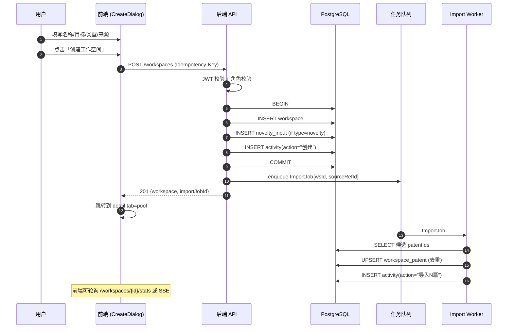
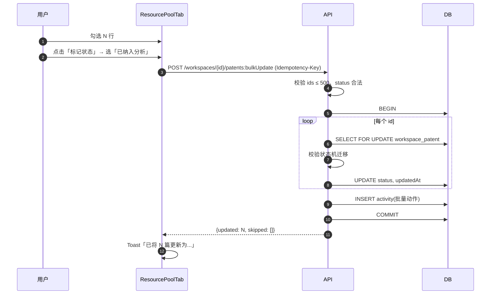
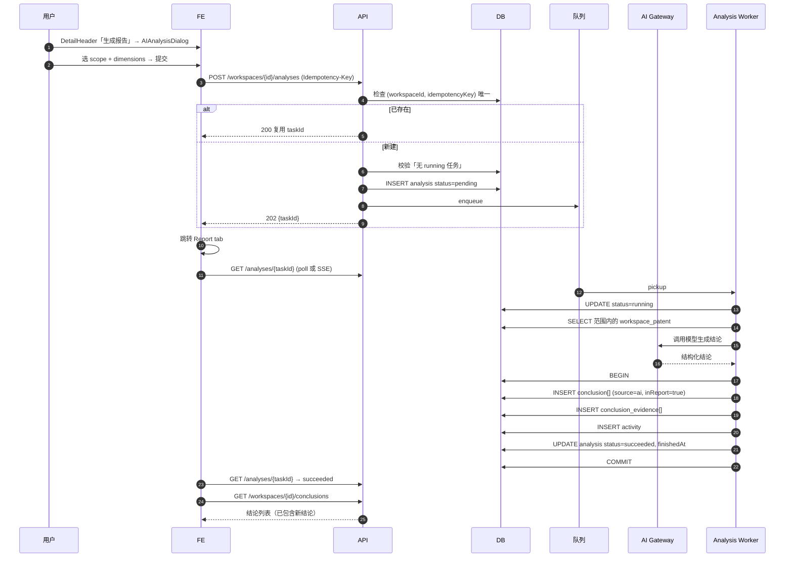
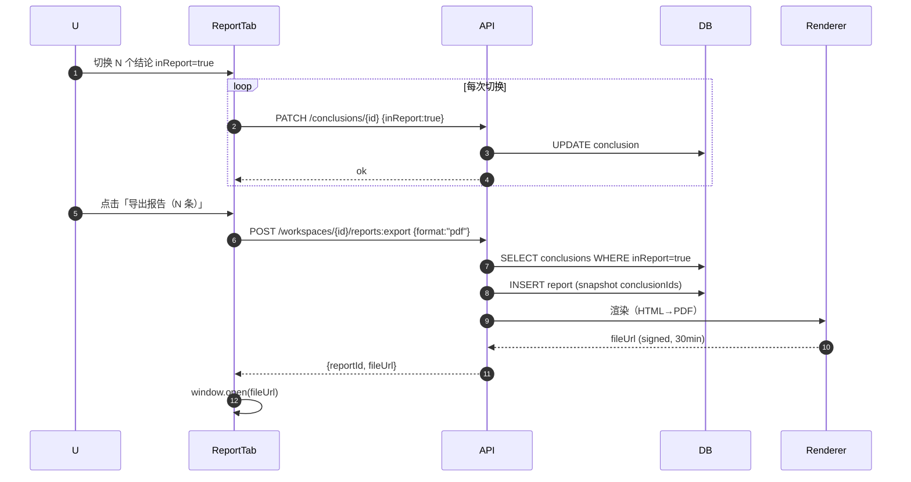

# 专利工作空间 — 后端 API 设计文档

> 适用项目：AI 专利创新空间（Patent Workspace）
> 版本：v1.0 · 最后更新：2026-04-21
> 范围：覆盖当前前端原型的 **全部** 用户交互（包括筛选/排序/批量操作/对话框）。
> 命名约定：所有接口前缀 `/api/v1`；响应统一信封 `{ code, message, data, requestId }`；时间统一 ISO-8601 UTC；ID 统一 `ULID`（26 字符字符串）。

---

## 目录

1. [交互盘点与分类（纯展示 / API / 本地状态）](#1-交互盘点与分类)
2. [数据模型（实体 + ER 图）](#2-数据模型)
3. [API 接口清单](#3-api-接口清单)
4. [关键业务流程（时序图）](#4-关键业务流程)
5. [非功能需求（鉴权 / 分页 / 幂等 / 事务）](#5-非功能需求)
6. [错误码总表](#6-错误码总表)

---

## 1. 交互盘点与分类

> 图例：🟢 **API** = 需要后端接口；🔵 **LOCAL** = 仅本地状态/UI；⚪ **STATIC** = 纯展示（hard-coded 文案/图例）。

### 1.1 全局 / 侧边栏 (`Sidebar.tsx`)

| 交互 | 类型 | 说明 |
|---|---|---|
| 显示 Logo「AI 专利创新空间」 | ⚪ STATIC | 静态文案 |
| 导航项「智能检索 / 创建新对话 / 我的订阅 / 专利专题库 / 专利工作空间 / 历史对话」 | 🟢 API（路由跳转） + ⚪ STATIC（菜单本身） | 当前原型仅高亮，未来路由切换；菜单结构本身可由 `/me/menus` 拉取 |
| Footer「武汉数为科技有限公司」 | ⚪ STATIC | — |

### 1.2 工作空间首页 (`WorkspaceHome.tsx`)

| 交互 | 类型 | 涉及接口 |
|---|---|---|
| 列表加载工作空间卡片 | 🟢 API | `GET /workspaces` |
| 关键词搜索 `q` | 🟢 API | `GET /workspaces?q=` |
| 类型筛选下拉（全部空间/查新结果分析/FTO/技术调研/竞品分析） | 🟢 API | `GET /workspaces?type=` |
| 状态筛选下拉（全部/进行中/已完成/已归档） | 🟢 API | `GET /workspaces?status=` |
| 下拉打开/关闭、当前选中项高亮 | 🔵 LOCAL | `useState` |
| 点击卡片进入详情 | 🟢 API | `GET /workspaces/{id}` |
| 卡片 disabled 状态视觉 | ⚪ STATIC（来自 `data.disabled`） | — |
| 「新建工作空间」按钮 | 🔵 LOCAL（弹窗状态） + 🟢 API（提交） | `POST /workspaces` |
| 空状态提示 | ⚪ STATIC | — |
| 卡片中的「专利数 / 结论数 / 日期」统计 | 🟢 API（随列表返回） | 统计字段在 list 接口聚合 |

### 1.3 新建工作空间对话框 (`CreateDialog.tsx`)

| 交互 | 类型 | 涉及接口 |
|---|---|---|
| Step 切换 (1↔2) | 🔵 LOCAL | — |
| 输入名称、目标 | 🔵 LOCAL | — |
| 选择分析类型（6 种，5 种 disabled） | 🔵 LOCAL；提交时校验 | — |
| 选择初始资料来源（查新/检索/专题库/空） | 🔵 LOCAL | — |
| 来源详情面板（查新摘要/检索式/专题库搜索） | 🟢 API（按需懒加载） | `GET /sources/novelty/latest`<br>`GET /sources/searches?q=`<br>`GET /sources/topics?q=` |
| 「待查方案」表单（仅 search/novelty 来源时） | 🔵 LOCAL；提交时随 body 上传 | — |
| 取消 / 上一步 / 下一步 | 🔵 LOCAL | — |
| 「创建工作空间」按钮 | 🟢 API | `POST /workspaces`（事务：创建 ws + 关联 source + 异步导入专利） |

### 1.4 详情页头部 (`DetailHeader.tsx`)

| 交互 | 类型 | 涉及接口 |
|---|---|---|
| 面包屑「专利工作空间 / {ws.name}」 | 🔵 LOCAL（导航） | — |
| 标题 / 状态 tag / meta（类型/来源/主题库/创建时间） | 🟢 API | 来自 `GET /workspaces/{id}` |
| 主题库链接 | 🟢 API | `GET /topics/{id}` |
| 「生成报告」按钮 → 打开 `AIAnalysisDialog` | 🔵 LOCAL（弹窗） | — |
| 免责声明黄色 banner | ⚪ STATIC | — |

### 1.5 AI 分析对话框 (`AIAnalysisDialog.tsx`)

| 交互 | 类型 | 涉及接口 |
|---|---|---|
| 选择分析范围（全部/重点/新增） | 🔵 LOCAL | — |
| 勾选报告维度（4 项，1 项 disabled） | 🔵 LOCAL | — |
| 预计耗时提示（基于 patentCount） | 🔵 LOCAL（前端计算） | — |
| 取消 / 提交 | 🟢 API | `POST /workspaces/{id}/analyses` （Idempotency-Key 必填） |
| 提交后跳转到 Report tab | 🔵 LOCAL | — |
| 任务进度（如需轮询） | 🟢 API | `GET /analyses/{taskId}` 或 SSE `/analyses/{taskId}/stream` |

### 1.6 Tabs 容器 (`WorkspaceDetail.tsx`)

| 交互 | 类型 |
|---|---|
| 6 个 Tab 切换（任务概览/资料池/分析视图/创新启发/结论报告/设置） | 🔵 LOCAL；当前 tab 可写入 URL query |
| 每个 Tab 内容懒加载 | 🟢 API（按 tab 拉取对应资源） |

### 1.7 任务概览 Tab (`OverviewTab.tsx`)

| 交互 | 类型 | 涉及接口 |
|---|---|---|
| 项目基础信息卡片 | 🟢 API | `GET /workspaces/{id}` |
| 5 项核心指标（当前专利数/已纳入/重点对比/已保存结论/启发卡片） | 🟢 API | `GET /workspaces/{id}/stats` |
| 查新摘要（发明名称/相似度/风险等级/系统结论） | 🟢 API | `GET /workspaces/{id}/novelty-summary` |
| 「保存为结论卡片」按钮 | 🟢 API | `POST /workspaces/{id}/conclusions` |
| 最近动作时间线（最多 N 条） | 🟢 API | `GET /workspaces/{id}/activities?limit=20` |

### 1.8 资料池 Tab (`ResourcePoolTab.tsx`) — **最复杂**

| 交互 | 类型 | 涉及接口 |
|---|---|---|
| 表格分页/排序加载专利 | 🟢 API | `GET /workspaces/{id}/patents?page=&pageSize=&sort=` |
| 关键词搜索（标题模糊） | 🟢 API | `?q=` |
| 状态筛选（全部状态 + 6 种业务状态） | 🟢 API | `?status=` |
| 来源筛选（全部/查新/检索/主题库） | 🟢 API | `?source=` |
| 列排序（按相似度/日期，原型未实现但应支持） | 🟢 API | `?sort=sim:desc` |
| 全选/单选行 checkbox | 🔵 LOCAL | — |
| 单条修改状态（行内下拉菜单） | 🟢 API | `PATCH /workspace-patents/{id}` `{status}` |
| 批量「标记状态」对话框 | 🟢 API | `POST /workspaces/{id}/patents:bulkUpdate` `{ids, patch:{status}}` |
| 批量「加入重点对比」 | 🟢 API | 同上 `{patch:{status:"重点对比"}}` |
| 批量「导出清单」 | 🟢 API | `POST /workspaces/{id}/patents:export` → 返回文件 URL |
| 单条「移出资料池」 | 🟢 API | `DELETE /workspace-patents/{id}` |
| 单条「添加/编辑备注」对话框 | 🟢 API | `PUT /workspace-patents/{id}/note` `{text}` |
| 「查看详情」按钮 | 🟢 API | `GET /patents/{patentId}`（外部专利元数据） |
| 「添加来源」对话框 | 🟢 API | `POST /workspaces/{id}/imports` |
| 来源详情子面板（查新/检索/专题库三种） | 🟢 API | `GET /sources/...`（同 1.3） |
| 「上传文件」选项 | ⚪ STATIC（即将支持，禁用） | — |
| 行内 Toast | 🔵 LOCAL | — |
| 表格底部统计（共/已纳入分析） | 🟢 API（随列表返回 total/aggregations） | — |

### 1.9 分析视图 Tab (`AnalysisViewTab.tsx`)

| 交互 | 类型 | 涉及接口 |
|---|---|---|
| 子视图切换（查新对比 / 列表分析 / 技术分支 / 申请人 / 时间线） — 后 4 个 disabled | 🔵 LOCAL；当前仅查新对比可用 | — |
| 「待查方案」+「TOP1」对比卡 | 🟢 API | `GET /workspaces/{id}/analysis/novelty-compare` |
| 相似点 / 差异点列表 | 🟢 API | 同上接口 |
| TOP3/TOP10 聚合差异点（按 性能/架构/应用 三组） | 🟢 API | `GET /workspaces/{id}/analysis/aggregated-diffs?topN=3` |
| 「AI 生成差异点总结」按钮 | 🟢 API | `POST /workspaces/{id}/analysis/aggregated-diffs:generate`（异步） |
| 风险点分析列表（高/中/低） | 🟢 API | `GET /workspaces/{id}/analysis/risks` |
| 「保存为结论」按钮 | 🟢 API | `POST /workspaces/{id}/conclusions` |

### 1.10 创新启发 Tab (`InnovationTab.tsx`)

| 交互 | 类型 | 涉及接口 |
|---|---|---|
| 「AI 生成创新启发」按钮 | 🟢 API | `POST /workspaces/{id}/innovations:generate`（异步任务） |
| 高/低覆盖技术方向（带百分比 progress） | 🟢 API | `GET /workspaces/{id}/innovations/coverage` |
| 空白点识别（3 块） | 🟢 API | `GET /workspaces/{id}/innovations/gaps` |
| 差异化建议列表（3 条） | 🟢 API | `GET /workspaces/{id}/innovations/suggestions` |
| 单条「加入报告」按钮（产生 InspirationCard） | 🟢 API | `POST /workspaces/{id}/inspiration-cards` `{suggestionId}` |
| 技术组合建议（2 卡） | 🟢 API | `GET /workspaces/{id}/innovations/combinations` |
| 启发卡片列表 | 🟢 API | `GET /workspaces/{id}/inspiration-cards` |
| 单卡「从报告移除/加入报告」切换 | 🟢 API | `PATCH /inspiration-cards/{id}` `{inReport}` |
| 单卡「移除卡片」(×) | 🟢 API | `DELETE /inspiration-cards/{id}` |
| Toast 提示 | 🔵 LOCAL | — |

### 1.11 结论报告 Tab (`ReportTab.tsx`)

| 交互 | 类型 | 涉及接口 |
|---|---|---|
| 顶部「生成报告」按钮 | 🟢 API | `POST /workspaces/{id}/analyses` |
| 「导出报告（N 条）」按钮 | 🟢 API | `POST /workspaces/{id}/reports:export` `{format:pdf\|docx, conclusionIds:[]}` |
| 8 节报告结构预览 | 🟢 API | `GET /workspaces/{id}/report/outline` |
| 结论卡片列表 | 🟢 API | `GET /workspaces/{id}/conclusions` |
| 单卡 toggle inReport | 🟢 API | `PATCH /conclusions/{id}` `{inReport}` |
| 单卡菜单：编辑结论 | 🟢 API | `PUT /conclusions/{id}` |
| 单卡菜单：查看溯源 | 🟢 API | `GET /conclusions/{id}/evidences` |
| 单卡菜单：复制内容 | 🔵 LOCAL（clipboard） | — |
| 单卡菜单：删除结论（带 confirm） | 🟢 API | `DELETE /conclusions/{id}` |
| 「AI 生成 / 人工新增」标签 | 🟢 API（来自 `source` 字段） | — |
| 免责声明 | ⚪ STATIC | — |

### 1.12 设置 Tab (`SettingsTab.tsx`)

| 交互 | 类型 | 涉及接口 |
|---|---|---|
| 编辑名称 / 目标 / 类型 / 主题库 | 🟢 API | `PATCH /workspaces/{id}` |
| 标签模板增删 | 🟢 API | `PUT /workspaces/{id}/tag-templates` |
| 「归档」按钮 | 🟢 API | `POST /workspaces/{id}:archive` |
| 「删除」按钮（带 confirm） | 🟢 API | `DELETE /workspaces/{id}` |
| 「取消 / 保存设置」 | 🔵 LOCAL（dirty）+ 🟢 API（保存） | — |

---

## 2. 数据模型

### 2.1 实体定义

| 实体 | 关键字段 | 备注 |
|---|---|---|
| **User** | id, email, name, avatar, orgId, createdAt | 来自 Lovable Cloud auth.users 镜像 |
| **Organization** | id, name, createdAt | 多租户隔离边界 |
| **UserRole** | id, userId, role(`owner\|admin\|member\|viewer`) | **必须独立表**，防止特权升级 |
| **Workspace** | id, orgId, ownerId, name, goal, type(`novelty\|fto\|tech\|comp\|draft\|rnd`), status(`active\|completed\|archived`), source, topicId, createdAt, updatedAt, deletedAt | 软删除 |
| **NoveltyInput** | id, workspaceId, inventionTitle, techDescription, patentType, createdAt | 1:1 with Workspace（仅 novelty 类型） |
| **Topic** | id, orgId, name, description, patentCount, updatedAt | 主题库 |
| **Patent** | id, publicationNumber, title, abstract, applicants[], inventors[], country, applyDate, publishDate, ipcCodes[], rawJson | 全局专利元数据，跨工作空间共享 |
| **WorkspacePatent** | id, workspaceId, patentId, source(`novelty\|search\|topic\|upload`), sourceRefId, status(`重点对比\|已纳入分析\|待筛选\|待复核\|暂不相关\|已归档`), similarity(decimal 0-100, nullable), tags[], note, addedById, addedAt, updatedAt | **(workspaceId, patentId) 唯一** |
| **Analysis (Task)** | id, workspaceId, scope(`all\|key\|new`), dimensions[], status(`pending\|running\|succeeded\|failed`), progress, idempotencyKey, requestedById, startedAt, finishedAt, errorMessage | 异步任务 |
| **Conclusion** | id, workspaceId, type(`风险判断\|差异点\|创新机会\|调整建议`), title, description, evidence, source(`ai\|manual`), inReport(bool), createdById, createdAt, updatedAt | |
| **ConclusionEvidence** | id, conclusionId, refType(`patent\|inspiration\|analysis`), refId, snippet | 溯源 |
| **InspirationCard** | id, workspaceId, sourceSuggestionId(nullable), title, description, source, type, inReport(bool), createdAt | |
| **Activity** | id, workspaceId, actorId, action, targetType, targetId, metadata, createdAt | 审计/最近动作 |
| **TagTemplate** | id, workspaceId, label, color | |
| **Report** | id, workspaceId, version, format(`pdf\|docx`), fileUrl, conclusionIds[], generatedAt | 导出快照 |
| **SearchQuery** | id, orgId, ownerId, name, expression, totalHits, createdAt | 检索结果（导入来源 1） |
| **NoveltyResult** | id, orgId, ownerId, name, inventionTitle, top1Similarity, riskLevel, candidatePatentIds[], createdAt | 查新结果（导入来源 2） |

### 2.2 业务状态机

**WorkspacePatent.status**
```
待筛选 ──▶ 重点对比 ──▶ 已纳入分析 ──▶ 已归档
   │                                  ▲
   ├─▶ 暂不相关 ─────────────────────────┤
   └─▶ 待复核 ─────────────────────────▶┘
```

**Workspace.status**: `active → completed`；任意态 `→ archived`（可逆）；archived 之外允许 `→ deleted`(soft)。

**Analysis.status**: `pending → running →(succeeded|failed)`，终态不可变。

### 2.3 ER 图

```mermaid
erDiagram
    Organization ||--o{ User : "has"
    Organization ||--o{ Workspace : "owns"
    Organization ||--o{ Topic : "owns"
    User ||--o{ UserRole : "assigned"
    User ||--o{ Workspace : "creates"

    Workspace ||--o| NoveltyInput : "1:1"
    Workspace }o--o| Topic : "linked"
    Workspace ||--o{ WorkspacePatent : "contains"
    Workspace ||--o{ Analysis : "runs"
    Workspace ||--o{ Conclusion : "produces"
    Workspace ||--o{ InspirationCard : "produces"
    Workspace ||--o{ Activity : "logs"
    Workspace ||--o{ TagTemplate : "defines"
    Workspace ||--o{ Report : "exports"

    Patent ||--o{ WorkspacePatent : "referenced"
    WorkspacePatent }o--|| Patent : "fk"

    Conclusion ||--o{ ConclusionEvidence : "cites"
    ConclusionEvidence }o--o| Patent : "may ref"
    ConclusionEvidence }o--o| InspirationCard : "may ref"
    ConclusionEvidence }o--o| Analysis : "may ref"

    Workspace }o--o| NoveltyResult : "imported from"
    Workspace }o--o| SearchQuery : "imported from"

    Organization {
        ulid id PK
        string name
    }
    User {
        ulid id PK
        string email UK
        string name
        ulid orgId FK
    }
    UserRole {
        ulid id PK
        ulid userId FK
        string role
    }
    Workspace {
        ulid id PK
        ulid orgId FK
        ulid ownerId FK
        string name
        text goal
        string type
        string status
        string source
        ulid topicId FK "nullable"
        timestamp createdAt
        timestamp deletedAt "soft"
    }
    Patent {
        ulid id PK
        string publicationNumber UK
        string title
        text abstract
        jsonb applicants
        string country
        date applyDate
    }
    WorkspacePatent {
        ulid id PK
        ulid workspaceId FK
        ulid patentId FK
        string source
        string status
        decimal similarity "nullable"
        jsonb tags
        text note
        timestamp addedAt
    }
    Analysis {
        ulid id PK
        ulid workspaceId FK
        string scope
        jsonb dimensions
        string status
        int progress
        string idempotencyKey UK
    }
    Conclusion {
        ulid id PK
        ulid workspaceId FK
        string type
        string title
        text description
        text evidence
        string source
        bool inReport
    }
    ConclusionEvidence {
        ulid id PK
        ulid conclusionId FK
        string refType
        ulid refId
        text snippet
    }
    InspirationCard {
        ulid id PK
        ulid workspaceId FK
        string title
        text description
        bool inReport
    }
    Activity {
        ulid id PK
        ulid workspaceId FK
        ulid actorId FK
        string action
        timestamp createdAt
    }
    Report {
        ulid id PK
        ulid workspaceId FK
        string format
        string fileUrl
        jsonb conclusionIds
    }
    NoveltyResult {
        ulid id PK
        ulid orgId FK
        string inventionTitle
        decimal top1Similarity
    }
    SearchQuery {
        ulid id PK
        ulid orgId FK
        string expression
        int totalHits
    }
    Topic {
        ulid id PK
        ulid orgId FK
        string name
        int patentCount
    }
    TagTemplate {
        ulid id PK
        ulid workspaceId FK
        string label
        string color
    }
    NoveltyInput {
        ulid id PK
        ulid workspaceId FK UK
        string inventionTitle
        text techDescription
    }
```

### 2.4 索引建议

- `workspace(orgId, status, updatedAt DESC)` — 列表查询
- `workspace_patent(workspaceId, status)` + `(workspaceId, source)` + `(workspaceId, similarity DESC)` — 资料池筛选/排序
- `workspace_patent UNIQUE(workspaceId, patentId)` — 防重复导入
- `activity(workspaceId, createdAt DESC)` — 时间线
- `conclusion(workspaceId, inReport, updatedAt DESC)`
- `analysis UNIQUE(workspaceId, idempotencyKey)` — 幂等

---

## 3. API 接口清单

### 3.1 通用约定

- **Base URL**: `/api/v1`
- **认证头**: `Authorization: Bearer <jwt>`
- **租户头**: 自动从 JWT 解析 `orgId`，无需显式传
- **幂等头（写操作可选/必填）**: `Idempotency-Key: <uuid>`
- **响应信封**:
  ```json
  { "code": 0, "message": "ok", "data": {...}, "requestId": "01HXXX..." }
  ```
- **分页参数**: `page`(从 1 起，默认 1), `pageSize`(默认 20，最大 100)
- **分页响应**:
  ```json
  { "items": [...], "page": 1, "pageSize": 20, "total": 142, "hasMore": true }
  ```

### 3.2 认证 / 用户

| # | Method | Path | 描述 | 权限 |
|---|---|---|---|---|
| A1 | POST | `/auth/login` | 邮箱密码登录 → 返回 JWT | 公开 |
| A2 | POST | `/auth/logout` | 登出，吊销 refresh | 已登录 |
| A3 | GET | `/me` | 当前用户 + 角色 + 组织 | 已登录 |
| A4 | GET | `/me/menus` | 侧边栏菜单（按角色） | 已登录 |

### 3.3 工作空间 CRUD

#### W1 — 列表

```
GET /workspaces?q=&type=&status=&page=&pageSize=&sort=updatedAt:desc
```
- **入参** (query):
  - `q` *(string, optional)* — 模糊匹配 name/desc
  - `type` *(enum, optional)* — `novelty|fto|tech|comp|draft|rnd|all`
  - `status` *(enum, optional)* — `active|completed|archived|all`
  - 分页/排序通用
- **出参** (`data`): 分页对象，每项含：
  ```ts
  { id, name, desc, type, typeTag, status, statusTag, patents, conclusions, date, fromNovelty, disabled }
  ```
- **权限**: 已登录；按 `orgId` 过滤
- **业务规则**: 默认排除 `deletedAt != null`；archived 仅在 `status=archived|all` 时返回

#### W2 — 创建

```
POST /workspaces      Idempotency-Key: <uuid>
```
- **入参** (body):
  ```ts
  {
    name: string,            // 必填，1-80
    goal: string,            // 必填，1-1000
    type: "novelty"|"fto"|"tech"|"comp"|"draft"|"rnd",
    source: "novelty"|"search"|"topic"|"empty",
    sourceRefId?: string,    // novelty/search/topic 时必填
    importAll?: boolean,     // 默认 true
    importTopN?: number,     // search/topic 时可选
    noveltyInput?: {         // type=novelty 时建议提供
      inventionTitle: string,
      techDescription: string,
      patentType: "invention"|"utility"|"design"
    }
  }
  ```
- **出参**: `{ workspace, importJobId? }`
- **权限**: `member` 及以上
- **业务规则**:
  - 同一 orgId 下 `name` 唯一性（软校验，可重名）
  - 事务边界：创建 Workspace + NoveltyInput + 启动异步 ImportJob 三步原子
  - source=empty 不创建 ImportJob
- **错误码**: `4001` 参数错误，`4093` 名称重复，`4290` 配额超限

#### W3 — 详情
```
GET /workspaces/{id}
```
- 出参：完整 workspace + ownerProfile + topic + noveltyInput
- 权限：成员 of org + 资源可见

#### W4 — 更新
```
PATCH /workspaces/{id}
```
- 入参：`{ name?, goal?, type?, topicId? }`
- 权限：`owner|admin`
- 业务规则：`type` 一旦有 Conclusion 数据则禁止变更（返回 `4094`）

#### W5 — 归档
```
POST /workspaces/{id}:archive    Idempotency-Key
```
- 出参：`{ status: "archived" }`
- 权限：`owner|admin`
- 副作用：所有写接口对该 ws 返回 `4035` 只读

#### W6 — 取消归档
```
POST /workspaces/{id}:unarchive
```

#### W7 — 删除（软）
```
DELETE /workspaces/{id}
```
- 权限：`owner`
- 业务规则：仅设置 `deletedAt`；底层 Patent 不删

#### W8 — 统计
```
GET /workspaces/{id}/stats
```
- 出参：`{ patentTotal, included, keyCompare, conclusions:{total,risk,diff,opportunity,adjust}, inspirationCards }`

#### W9 — 最近动作
```
GET /workspaces/{id}/activities?limit=20&before=<cursor>
```
- 游标分页（按 createdAt DESC）

#### W10 — 查新摘要
```
GET /workspaces/{id}/novelty-summary
```
- 出参：`{ inventionTitle, top1Similarity, top10Avg, top100Hits, riskLevel, summary }`
- 仅 `type=novelty` 有效，否则 `4044`

### 3.4 资源/导入来源

| # | Method | Path | 描述 |
|---|---|---|---|
| S1 | GET | `/sources/novelty/latest` | 最近一次查新结果摘要 |
| S2 | GET | `/sources/searches?q=&limit=` | 我的检索历史 |
| S3 | GET | `/sources/topics?q=&limit=` | 主题库列表 |
| S4 | GET | `/topics/{id}` | 主题库详情 |
| S5 | POST | `/workspaces/{id}/imports`  *(Idempotency-Key)* | 添加来源（异步导入） |

**S5 入参**:
```ts
{
  source: "novelty"|"search"|"topic"|"upload",
  refId: string,
  scope?: "all"|"top20"|"top50"|"key",  // search/topic 时
  fileId?: string                        // upload 时（上传 API 另议）
}
```
**S5 出参**: `{ jobId, expectedCount }`
**业务规则**: 重复导入按 `(workspaceId, patentId)` 去重；冲突时不报错，统计返回 `imported / skipped`

### 3.5 资料池（WorkspacePatent）

#### P1 — 列表

```
GET /workspaces/{id}/patents
    ?q=&status=&source=&country=&applicant=
    &simMin=&simMax=
    &sort=similarity:desc|addedAt:desc|applyDate:desc
    &page=&pageSize=
```
- **筛选维度**全部对应前端：搜索、状态、来源；额外开放 country/applicant/相似度区间
- **出参**: 分页 + 聚合 `aggregations: { byStatus, bySource }`
- **权限**: workspace 成员

#### P2 — 单条更新（状态/标签/相似度）
```
PATCH /workspace-patents/{id}
```
- 入参：`{ status?, tags?, similarity? }`
- 业务规则：status 必须落入合法状态机迁移；越权迁移返回 `4221`
- 副作用：写 Activity

#### P3 — 备注
```
PUT /workspace-patents/{id}/note
```
- 入参：`{ text: string (≤ 2000) }`；空字符串视为删除备注

#### P4 — 移出
```
DELETE /workspace-patents/{id}
```
- 权限：`member` 以上；不会删除全局 Patent

#### P5 — 批量更新
```
POST /workspaces/{id}/patents:bulkUpdate    Idempotency-Key
```
- 入参：`{ ids: string[], patch: { status?: string, tagsAdd?: [], tagsRemove?: [] } }`
- 出参：`{ updated: number, skipped: [{id, reason}] }`
- 事务：单事务内 update；失败整批回滚
- 上限：`ids.length ≤ 500`

#### P6 — 批量导出
```
POST /workspaces/{id}/patents:export
```
- 入参：`{ ids?: string[], filter?: { status?, source? }, format: "csv"|"xlsx" }`
- 出参：`{ fileUrl, expiresAt }`（短期签名 URL，30 min）

#### P7 — 专利元数据查看
```
GET /patents/{patentId}
```
- 全局只读；权限：已登录

### 3.6 分析 / AI 任务

#### AN1 — 提交分析
```
POST /workspaces/{id}/analyses    Idempotency-Key (必填)
```
- 入参：`{ scope: "all"|"key"|"new", dimensions: string[] }`
- 出参：`{ taskId, status: "pending", estimatedDurationSec }`
- 业务规则：
  - 同 ws 同时 `pending|running` 任务 ≤ 1，否则 `4291`
  - dimensions 至少 1 项
- 异步：完成后写 Conclusion + Activity

#### AN2 — 任务状态
```
GET /analyses/{taskId}
```
- 出参：`{ status, progress(0-100), result?, errorCode? }`

#### AN3 — SSE 流（可选）
```
GET /analyses/{taskId}/stream    Accept: text/event-stream
```

#### AN4 — 查新对比视图
```
GET /workspaces/{id}/analysis/novelty-compare
```
- 出参：`{ ours: {...}, top1: {...}, similarities: [], differences: [] }`

#### AN5 — 聚合差异点
```
GET /workspaces/{id}/analysis/aggregated-diffs?topN=3|10
```

#### AN6 — 触发 AI 聚合差异生成
```
POST /workspaces/{id}/analysis/aggregated-diffs:generate
```

#### AN7 — 风险列表
```
GET /workspaces/{id}/analysis/risks
```

### 3.7 创新启发

| # | Method | Path | 描述 |
|---|---|---|---|
| I1 | POST | `/workspaces/{id}/innovations:generate` *(Idempotency)* | 触发 AI 生成创新启发 |
| I2 | GET | `/workspaces/{id}/innovations/coverage` | 高/低覆盖技术方向 |
| I3 | GET | `/workspaces/{id}/innovations/gaps` | 空白点识别 |
| I4 | GET | `/workspaces/{id}/innovations/suggestions` | 差异化建议 |
| I5 | GET | `/workspaces/{id}/innovations/combinations` | 技术组合建议 |
| I6 | GET | `/workspaces/{id}/inspiration-cards?inReport=` | 启发卡片列表 |
| I7 | POST | `/workspaces/{id}/inspiration-cards` | 新增（通常从 suggestion 转化） |
| I8 | PATCH | `/inspiration-cards/{id}` | 更新（toggle inReport / 编辑） |
| I9 | DELETE | `/inspiration-cards/{id}` | 删除卡片 |

**I7 入参**: `{ sourceSuggestionId?, title, description, type }`
**业务规则**: 同一 `sourceSuggestionId` 在同 ws 内仅可创建一次（防重复加入报告）

### 3.8 结论与报告

| # | Method | Path | 描述 |
|---|---|---|---|
| C1 | GET | `/workspaces/{id}/conclusions?inReport=&type=` | 列表 |
| C2 | POST | `/workspaces/{id}/conclusions` | 新增（人工或保存自分析） |
| C3 | PUT | `/conclusions/{id}` | 编辑结论（标题/描述/证据） |
| C4 | PATCH | `/conclusions/{id}` | 局部更新（toggle inReport） |
| C5 | DELETE | `/conclusions/{id}` | 删除（带版本号防误删） |
| C6 | GET | `/conclusions/{id}/evidences` | 溯源详情 |
| C7 | GET | `/workspaces/{id}/report/outline` | 8 节大纲 |
| C8 | POST | `/workspaces/{id}/reports:export` *(Idempotency)* | 生成导出文件 |
| C9 | GET | `/workspaces/{id}/reports` | 历史报告列表 |

**C2 入参**:
```ts
{
  type: "风险判断"|"差异点"|"创新机会"|"调整建议",
  title: string,
  description: string,
  evidence?: string,
  source?: "manual"|"ai",       // 默认 manual
  inReport?: boolean,           // 默认 false
  evidenceRefs?: [{ refType, refId, snippet? }]
}
```

**C5 入参**:
- Header: `If-Match: <updatedAt>` — 乐观锁，避免并发删错

**C8 入参**:
```ts
{ format: "pdf"|"docx", conclusionIds?: string[], includeInspirationCards?: boolean }
```
- 出参: `{ reportId, fileUrl, expiresAt }`
- 业务规则：缺省取 `inReport=true` 的结论；生成快照写 Report 表

### 3.9 设置 / 标签模板

| # | Method | Path | 描述 |
|---|---|---|---|
| T1 | GET | `/workspaces/{id}/tag-templates` | 列表 |
| T2 | PUT | `/workspaces/{id}/tag-templates` | 全量替换 `{ items: [{label, color}] }` |

---

## 4. 关键业务流程

### 4.1 创建工作空间（含查新导入）



### 4.2 资料池：批量更新状态



### 4.3 生成报告（异步 AI）



### 4.4 加入报告 → 导出 PDF



---

## 5. 非功能需求

### 5.1 鉴权 / 授权

- **认证**：Lovable Cloud Auth（JWT, RS256）。前端在 `Authorization: Bearer` 中携带；refresh token 通过 httpOnly cookie。
- **授权**：基于 `user_roles` 独立表 + `has_role(uuid, app_role)` SECURITY DEFINER 函数。RLS 策略示例：
  ```sql
  -- 仅本组织可见
  create policy ws_select on workspace for select to authenticated
  using (org_id = (select org_id from user_roles where user_id = auth.uid()));
  ```
- **角色**：`owner > admin > member > viewer`
  - viewer：只读所有 GET 接口
  - member：读写 ws 内业务（patents/conclusions/cards）
  - admin：管理设置、归档
  - owner：删除 ws、转让
- **跨租户**：所有写操作必须校验 `resource.orgId == jwt.orgId`，否则 403。
- **审计**：所有写动作落 `activity` 表（可关联到「最近动作」时间线）。

### 5.2 分页规则

| 模式 | 适用 | 参数 | 说明 |
|---|---|---|---|
| **Offset 分页** | 列表（workspace、patents） | `page, pageSize` | 总数已知；max pageSize=100 |
| **Cursor 分页** | 流式（activities、SSE 事件） | `before=<ulid>, limit` | 性能更好，禁止跳页 |
| **TopN** | 检索结果导入 | `topN` | 与业务术语对齐（TOP1/TOP10/TOP100） |

排序统一使用 `sort=field:asc|desc`，可叠加多个 `sort=a:desc&sort=b:asc`。

### 5.3 幂等性

- **必填 Idempotency-Key**：所有改变状态且可能被用户重复点击的 POST：
  - `POST /workspaces`
  - `POST /workspaces/{id}/imports`
  - `POST /workspaces/{id}/analyses`
  - `POST /workspaces/{id}/innovations:generate`
  - `POST /workspaces/{id}/patents:bulkUpdate`
  - `POST /workspaces/{id}/reports:export`
  - 所有 `:archive` / `:unarchive`
- **实现**：服务端用 `(orgId, route, idempotencyKey)` 唯一索引；24h 内复用相同响应。
- **PATCH/PUT/DELETE**：天然幂等，配合 `If-Match: <updatedAt>` 实现乐观锁。

### 5.4 事务边界

| 场景 | 事务范围 |
|---|---|
| 创建 ws | workspace + novelty_input + activity（**单事务**），ImportJob 入队为补偿事务 |
| 批量更新专利状态 | 全部 update + activity（**单事务**），失败整批回滚 |
| 移出资料池 | workspace_patent.delete + activity |
| AI 分析 worker 写结论 | 一次任务全部结论 + evidence + activity + analysis.status 更新（**单事务**） |
| 导出报告 | 选取 conclusions（READ COMMITTED 快照）+ INSERT report；文件渲染在事务外 |
| 删除工作空间 | UPDATE workspace SET deletedAt + activity（不级联删 patent） |

### 5.5 速率与配额

- 全局：每 user 每分钟 600 reqs；每 IP 1200 reqs
- AI 任务：每 ws 同时 ≤ 1 running，每 org 每日 ≤ 100 次
- 导出：每 ws 每小时 ≤ 10 次

### 5.6 可观测性

- 每响应携带 `X-Request-Id`
- AI 任务存 `errorMessage`，并归档到日志系统
- Activity 表 = 业务级审计；系统级日志独立

### 5.7 安全清单

- ✅ 角色存独立表（**绝不可放 profile**）
- ✅ RLS 启用，所有租户级表 enable row level security
- ✅ 文件 URL 短期签名
- ✅ 导出文件不直传，先渲染到对象存储
- ✅ 用户输入（goal/note/conclusion）做 HTML escape；Markdown 渲染走白名单

---

## 6. 错误码总表

| code | HTTP | 含义 |
|---|---|---|
| 0 | 200/201 | 成功 |
| 4001 | 400 | 参数校验失败（含字段说明） |
| 4002 | 400 | Idempotency-Key 缺失 |
| 4010 | 401 | 未登录 / token 失效 |
| 4030 | 403 | 无权限 |
| 4031 | 403 | 跨租户访问 |
| 4035 | 403 | 资源已归档，只读 |
| 4040 | 404 | 资源不存在 |
| 4044 | 404 | 类型不匹配（如 novelty-summary 调用在非 novelty 空间） |
| 4090 | 409 | 乐观锁冲突（updatedAt 不匹配） |
| 4093 | 409 | 名称重复 |
| 4094 | 409 | 状态机非法迁移 / 类型变更被禁 |
| 4221 | 422 | 业务规则不满足（如 dimensions 为空） |
| 4290 | 429 | 配额超限 |
| 4291 | 429 | 已有运行中的同类任务 |
| 5000 | 500 | 服务器内部错误 |
| 5030 | 503 | AI Gateway 暂不可用 |

---

## 附录 A：前端字段 → 后端字段映射（节选）

| 前端 (`data.ts`) | 后端 (DB) |
|---|---|
| `Workspace.id` | `workspace.id` |
| `Workspace.name/desc` | `workspace.name/goal` |
| `Workspace.type` (中文) | `workspace.type` (枚举) + `i18n` |
| `Workspace.typeTag` | 由后端按枚举映射，前端不再硬编码 |
| `Workspace.patents` | `workspace.stats.patentTotal`（W8 接口） |
| `Workspace.conclusions` | `workspace.stats.conclusions.total` |
| `Workspace.date` | `workspace.updatedAt` 格式化 |
| `Workspace.fromNovelty` | `workspace.type === "novelty"` |
| `Patent.sim/simColor` | `workspace_patent.similarity` + 前端按阈值上色 |
| `ConclusionCard.source = "ai"\|"manual"` | `conclusion.source` |

## 附录 B：未来扩展位

- 协作：`workspace_member` 表 + 实时 presence
- 评论/讨论：`comment` 表挂在 conclusion / patent 上
- 版本化报告：`report.version` 已预留
- Webhook：分析完成时回调外部 IM
